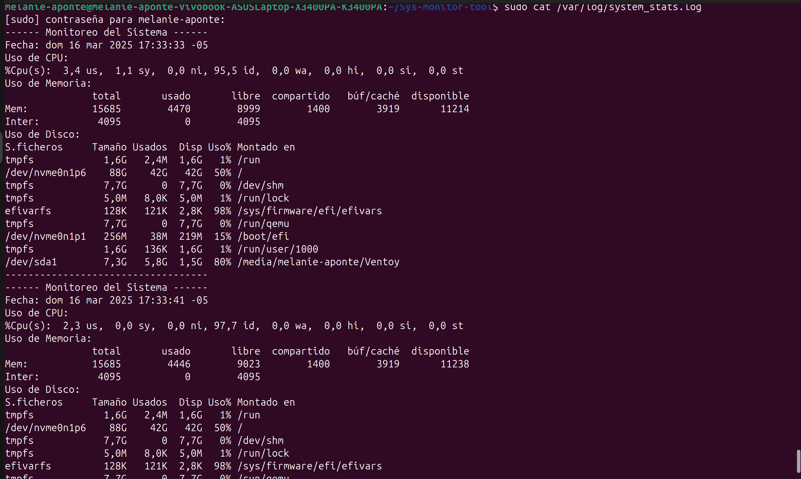
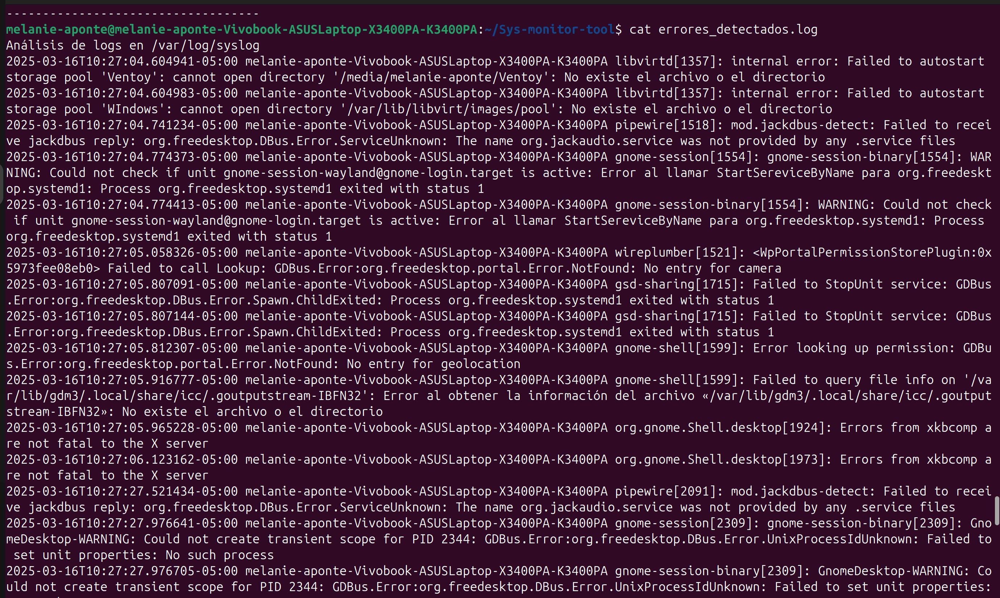
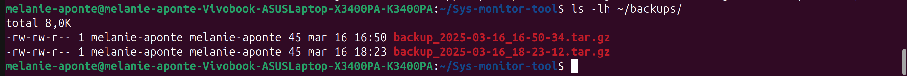

Manual de Sys Monitor Tool
1. Cómo se ejecutaron e instalaron los scripts

* Clonación del repositorio Primero, clona el repositorio en tu máquina local: 
     git clone https://github.com/TU-USUARIO/sys-monitor-tool.git
     cd sys-monitor-tool
* Instalación de dependencias Este proyecto no tiene dependencias adicionales aparte de los comandos nativos de Linux
* Dar permisos de ejecución a los scripts Asegúrate de que los scripts tienen permisos de ejecución:
	chmod +x resource_monitor.sh backup_manager.sh log_analyzer.sh
* Mover los scripts a un directorio accesible globalmente (opcional) Para poder ejecutar los scripts desde cualquier lugar,
 mueve los scripts a /usr/local/bin:
	sudo mv *.sh /usr/local/bin/

2. Explicación de cada comando Bash usado
   Aquí se explica cómo y por qué se usaron comandos específicos en los scripts.
* awk: Usado para procesar y manipular texto, especialmente para extraer partes de la salida de comandos como ps o top.
 Ejemplo:
	top -bn1 | awk '/Cpu/ {print $2}'
 Esto extrae el porcentaje de cpu utilizado 
* tar: Usado para crear archivos comprimidos (tarballs), especialmente en el script de backups.
 Ejemplo:
	 tar -czf /backups/backup_$(date +"%Y-%m-%d").tar.gz /ruta_a_respaldo
* grep: Usado para buscar patrones dentro de archivos, como en el script de análisis de logs.
 Ejemplo:
	 grep -i "error" /var/log/syslog
 Esto busca cualquier ocurrencia de "error" en los logs del sistema.

## Pantallazos de los Logs Generados

### **Ejemplo de monitoreo del sistema**

### **Ejemplo de errores detectados en logs**

### **Backups generados**

Es posible que los scripts se comporten de manera diferente en varias distribuciones de Linux.

   * En Ubuntu: Ubuntu tiene la mayoría de las dependencias preinstaladas, por lo que solo es necesario
    asegurarse de tener acceso al terminal y los permisos adecuados para ejecutar los scripts.

   * En Debian: Similar a Ubuntu, pero podría ser necesario instalar algunas dependencias adicionales como ifstat,
     que se usa para monitorear el tráfico de red.

   * En Kali Linux: Kali tiene herramientas preinstaladas para pruebas de penetración, pero es posible que debas
     instalar herramientas de monitoreo de sistema como htop o ifstat.
   * Para ver historial de commits:
	git log --oneline --graph --all

